Markdown es un lenguaje de marcado ligero que puedes usar para añadir elementos de formato a documentos de texto plano. Creado por John Gruber en 2004, Markdown es ahora uno de los lenguajes de marcado más populares del mundo.

En esta guía aprenderás desde la sintaxis básica hasta técnicas avanzadas como la creación de diagramas profesionales que puedes usar en documentación técnica, presentaciones y proyectos.

## Ejemplos de Diagramas que Aprenderás a Crear

<div style="display: grid; grid-template-columns: repeat(auto-fit, minmax(300px, 1fr)); gap: 20px; margin: 20px 0;">

### Diagrama de Arquitectura de Sistema

*Ideal para documentar arquitecturas full-stack y flujos de datos*

### Diagrama de Flujo de Aplicación React

*Perfecto para visualizar el flujo de componentes y estados en aplicaciones*

### Diagrama de Secuencia

*Excelente para documentar APIs y procesos de comunicación*

</div>


## Sintaxis Básica

### Encabezados

```markdown
# H1 - Encabezado Principal
## H2 - Encabezado de Sección
### H3 - Encabezado de Subsección
#### H4 - Encabezado de Nivel 4
##### H5 - Encabezado de Nivel 5
###### H6 - Encabezado de Nivel 6
```

**Resultado:**
## H2 - Encabezado de Sección
### H3 - Encabezado de Subsección

### Énfasis y Formato de Texto

```markdown
*Texto en cursiva* o _Texto en cursiva_
**Texto en negrita** o __Texto en negrita__
***Texto en negrita y cursiva*** o ___Texto en negrita y cursiva___
~~Tachado~~
`Código en línea`
==Texto resaltado== (en algunos procesadores)
```

**Resultado:**
- *Texto en cursiva*
- **Texto en negrita**
- ***Texto en negrita y cursiva***
- ~~Tachado~~
- `Código en línea`

### Listas

#### Listas No Ordenadas
```markdown
- Primer elemento
- Segundo elemento
- Tercer elemento
  - Elemento indentado
  - Otro elemento indentado
    - Elemento doblemente indentado

* También puedes usar asteriscos
+ O signos de suma
```

#### Listas Ordenadas
```markdown
1. Primer elemento
2. Segundo elemento
3. Tercer elemento
   1. Elemento indentado
   2. Otro elemento indentado
      1. Elemento doblemente indentado

<!-- También funciona con números desordenados -->
1. Primer elemento
1. Segundo elemento (Markdown lo numerará correctamente)
1. Tercer elemento
```

#### Listas de Tareas
```markdown
- [x] Tarea completada
- [ ] Tarea pendiente
- [x] ~~Tarea completada y tachada~~
- [ ] Tarea con **texto en negrita**
- [ ] Tarea con [enlace](https://ejemplo.com)
```

### Enlaces e Imágenes

```markdown
<!-- Enlaces básicos -->
[Texto del enlace](https://www.ejemplo.com)
[Enlace con título](https://www.ejemplo.com "Título del enlace")

<!-- Enlaces de referencia -->
[Texto del enlace][1]
[1]: https://www.ejemplo.com "Título opcional"

<!-- Enlaces automáticos -->
<https://www.ejemplo.com>
<email@ejemplo.com>

<!-- Imágenes -->


<!-- Imagen con enlace -->
[](https://ejemplo.com)
```

### Código

#### Código en Línea
```markdown
Usa `console.log()` para imprimir en la consola.
Puedes usar ``código con `backticks` dentro`` si necesitas backticks literales.
```

#### Bloques de Código
```markdown
```javascript
// Bloque de código JavaScript
const saludo = "¡Hola, mundo!";
console.log(saludo);

function sumar(a, b) {
  return a + b;
}
```

```python
# Bloque de código Python
def saludar(nombre):
    return f"¡Hola, {nombre}!"

print(saludar("Felipe"))
```

```css
/* Bloque de código CSS */
.ejemplo {
  color: #333;
  font-size: 16px;
  margin: 10px 0;
}
```
```

### Citas

```markdown
> Esto es una cita simple.

> Esta es una cita multilínea.
> Puede abarcar varias líneas
> y mantener el formato.

> ## Citas con otros elementos
> 
> - Pueden contener listas
> - Y otros elementos de Markdown
> 
> **Texto en negrita** dentro de una cita.

> Citas anidadas
>> Esto es una cita dentro de otra cita
>>> Y esto es una cita de tercer nivel
```

### Líneas Horizontales

```markdown
---
***
___

<!-- Todas crean el mismo efecto -->
```

## Sintaxis Extendida

### Tablas

```markdown
| Columna 1 | Columna 2 | Columna 3 |
|-----------|-----------|-----------|
| Dato 1    | Dato 2    | Dato 3    |
| Dato 4    | Dato 5    | Dato 6    |

<!-- Alineación -->
| Izquierda | Centro | Derecha |
|:----------|:------:|--------:|
| Texto     | Texto  | Texto   |
| Más texto | Texto  | Texto   |

<!-- Tabla con formato -->
| Función | Descripción | Ejemplo |
|---------|-------------|---------|
| `console.log()` | Imprime en consola | `console.log("Hola")` |
| `alert()` | Muestra una alerta | `alert("Mensaje")` |
| `Math.random()` | Número aleatorio | `Math.random()` |
```

### Notas al Pie

```markdown
Aquí hay una oración con una nota al pie[^1]. Y aquí hay otra[^nota-larga].

[^1]: Esta es la primera nota al pie.
[^nota-larga]: Esta es una nota al pie más larga que puede
    abarcar varias líneas. Todas las líneas subsecuentes
    deben estar indentadas.
```

### Definiciones

```markdown
Término 1
: Definición 1

Término 2
: Definición 2a
: Definición 2b

Término con *formato*
: Las definiciones pueden contener **texto formateado**.
```

## Diagramas con Mermaid

Mermaid es una de las características más poderosas de Markdown moderno. Te permite crear diagramas profesionales directamente en tu documentación usando sintaxis de texto simple.

### ¿Por qué usar Mermaid?

- **Versionado**: Los diagramas se guardan como texto, perfectos para Git
- **Mantenimiento**: Fácil de actualizar y modificar
- **Integración**: Compatible con GitHub, GitLab, Notion y muchas plataformas
- **Consistencia**: Estilo profesional automático

## Tipos de Diagramas Avanzados

### 1. Diagramas de Flujo

Los diagramas de flujo son ideales para documentar procesos, algoritmos y flujos de aplicaciones.


```markdown
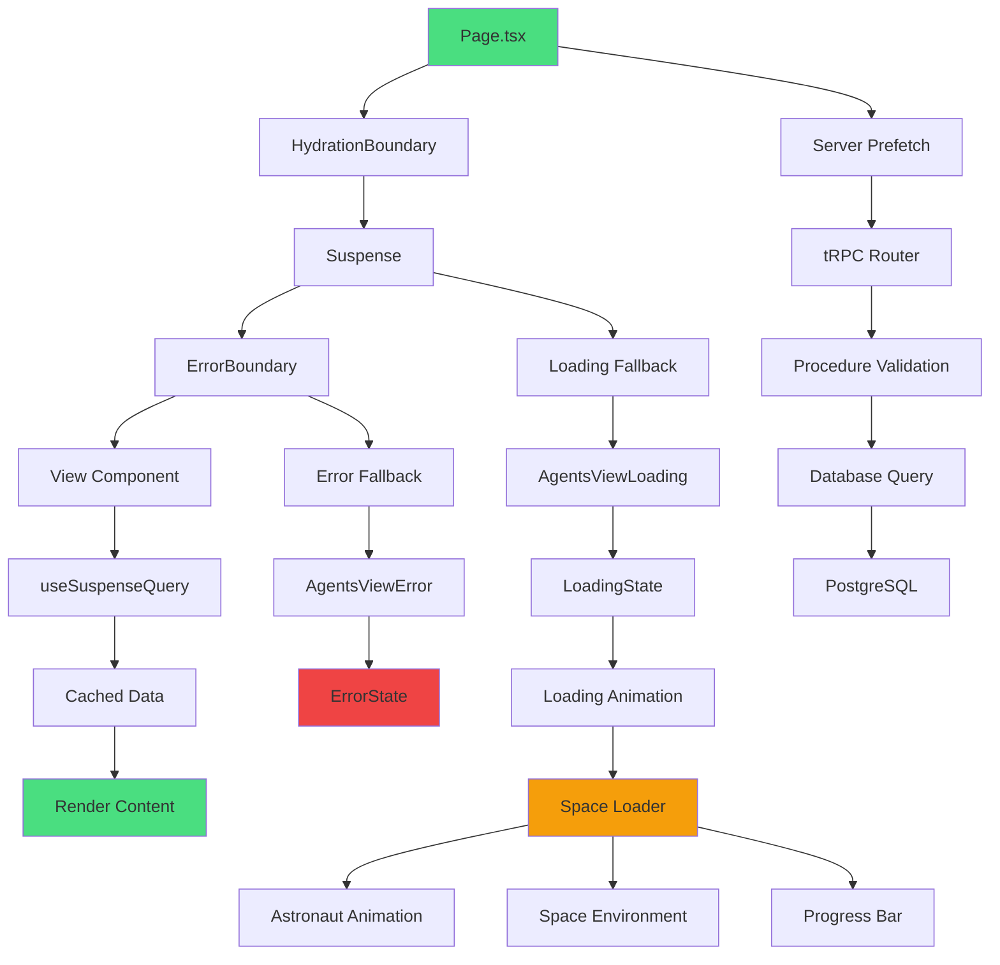
```

**Casos de uso:**
- Documentación de arquitectura de aplicaciones React
- Flujos de manejo de errores y estados de carga
- Procesos de validación y autenticación
- Algoritmos y lógica de negocio

### 2. Diagramas de Secuencia

Perfectos para documentar APIs, procesos de comunicación y flujos temporales.


```markdown
```mermaid
sequenceDiagram
    participant U as User
    participant P as Page
    participant S as Server
    participant D as Database
    participant C as Cache
    
    Note over U,C: Initial Page Load
    U->>P: Navigate to /agents
    P->>S: Server-side prefetch
    S->>D: Query agents data
    D-->>S: Return data
    S->>C: Populate cache
    S-->>P: Hydrated state
    P-->>U: Instant render
    
    Note over U,C: No loading state needed
    rect rgb(64, 64, 64)
        Note over P,C: React Query cache & tRPC type safety
    end
    
    Note over U,C: User Navigation
    U->>P: Navigate away & back
    P->>C: Check cache
    C-->>P: Return cached data
    P-->>U: Instant render
    
    Note over U,C: Background refetch if stale
    rect rgb(64, 64, 64)
        P->>S: Background refetch
        S->>D: Query fresh data
        D-->>S: Updated data
        S-->>P: Update cache
    end
```
```

**Casos de uso:**
- Documentación de APIs REST y GraphQL
- Flujos de autenticación OAuth
- Procesos de pago y transacciones
- Comunicación entre microservicios

### 3. Diagramas de Arquitectura

Ideales para mostrar la estructura completa de sistemas complejos.


```markdown
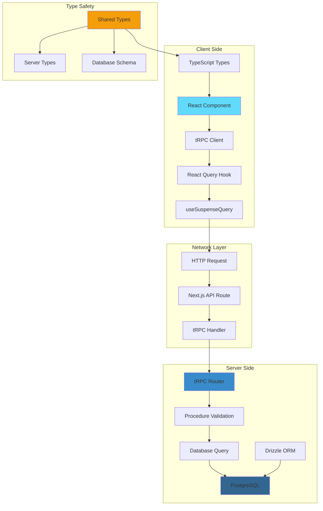
```

**Casos de uso:**
- Arquitecturas full-stack modernas
- Sistemas de microservicios
- Infraestructura cloud
- Flujos de datos complejos

### 4. Diagramas de Gantt

Perfectos para planificación de proyectos y cronogramas.

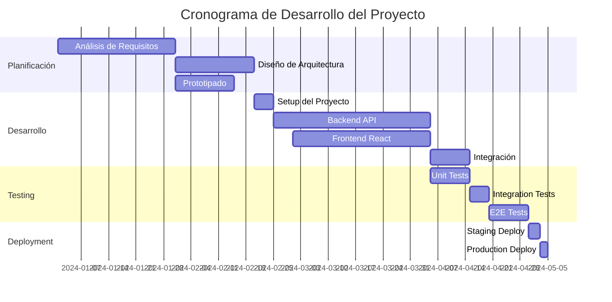

```markdown

```

### 5. Diagramas de Clases

Excelentes para documentar arquitecturas orientadas a objetos.

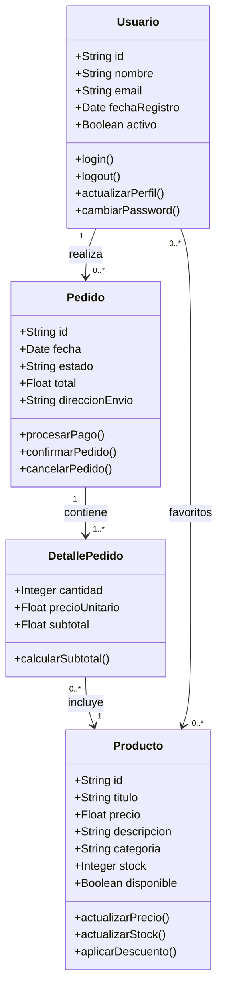

### 6. Diagramas de Estados

Ideales para documentar máquinas de estado y flujos de vida.

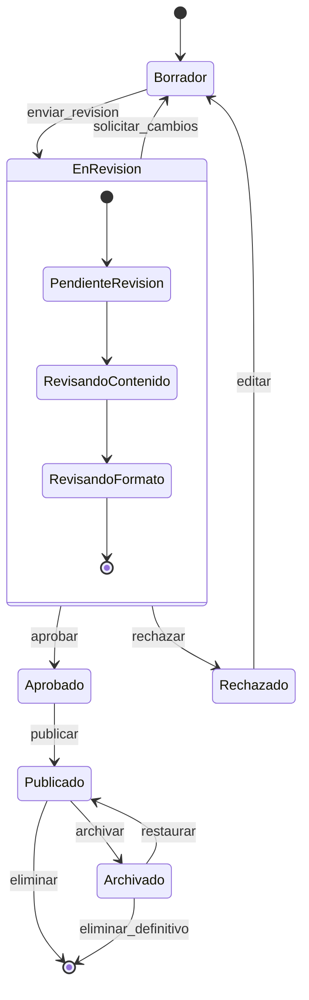

### 7. Diagramas de Red

Perfectos para infraestructura y topologías de red.

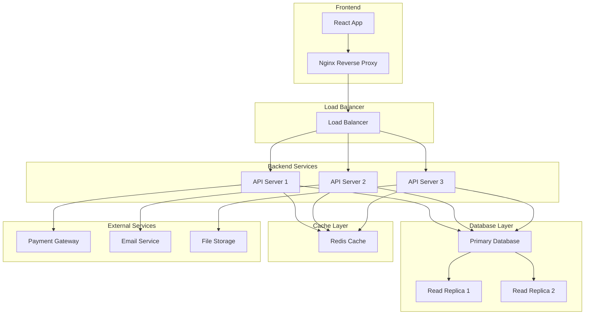

## Consejos para Diagramas Efectivos

### 1. Planificación
```markdown
<!-- Antes de crear el diagrama, define: -->
- ¿Cuál es el propósito del diagrama?
- ¿Quién es la audiencia?
- ¿Qué nivel de detalle necesitas?
- ¿Qué tipo de diagrama es más apropiado?
```

### 2. Estilo y Consistencia
```markdown
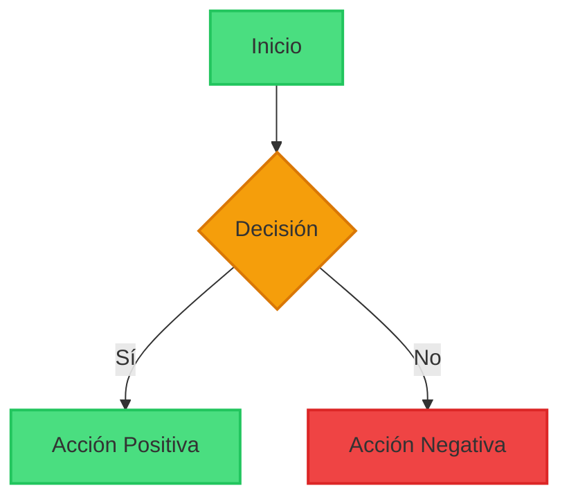
```

### 3. Documentación de Diagramas
```markdown
<!-- Siempre incluye contexto -->
## Diagrama de Flujo de Autenticación

Este diagrama muestra el proceso completo de autenticación de usuarios,
incluyendo el manejo de errores y la validación de tokens.

```mermaid
<!-- Tu diagrama aquí -->
```

**Notas importantes:**
- Los tokens expiran después de 24 horas
- Se requiere verificación 2FA para operaciones sensibles
- Los errores se registran en el sistema de logs
```

## Fórmulas Matemáticas

### LaTeX/MathJax

```markdown
<!-- Fórmulas en línea -->
La fórmula de Einstein es $E = mc^2$.

<!-- Fórmulas en bloque -->
$$\sum_{i=1}^{n} x_i = x_1 + x_2 + \cdots + x_n$$

<!-- Fórmulas complejas -->
$$\int_{-\infty}^{\infty} e^{-x^2} dx = \sqrt{\pi}$$

<!-- Matrices -->
$$\begin{pmatrix}
a & b \\
c & d
\end{pmatrix}$$

<!-- Sistemas de ecuaciones -->
$$\begin{cases}
x + y = 5 \\
2x - y = 1
\end{cases}$$
```

## Elementos HTML en Markdown

```markdown
<!-- Puedes usar HTML directamente -->
<div style="color: red;">Texto rojo</div>

<details>
<summary>Haz clic para expandir</summary>
Contenido colapsable que se muestra al hacer clic.
</details>

<kbd>Ctrl</kbd> + <kbd>C</kbd> para copiar

<mark>Texto resaltado</mark>

<sub>subíndice</sub> y <sup>superíndice</sup>

<!-- Comentarios HTML (no se muestran) -->
<!-- Este es un comentario -->
```

## Elementos Avanzados

### Alertas y Admoniciones

```markdown
> [!NOTE]
> Información útil que los usuarios deben conocer.

> [!TIP]
> Consejo opcional que puede ser útil.

> [!IMPORTANT]
> Información crucial que los usuarios necesitan saber.

> [!WARNING]
> Contenido crítico que necesita atención inmediata.

> [!CAUTION]
> Consecuencias negativas de una acción.
```

### Escape de Caracteres

```markdown
<!-- Para mostrar caracteres especiales literalmente -->
\* No es una lista
\# No es un encabezado
\[No es un enlace\]
\`No es código\`

<!-- Caracteres que necesitan escape -->
\ ` * _ { } [ ] ( ) # + - . !
```

## Mejores Prácticas

### 1. Estructura y Organización
- **Usa encabezados jerárquicamente**: Comienza con H1 y usa niveles inferiores para subsecciones
- **Añade una tabla de contenidos** para documentos largos
- **Usa líneas en blanco** para separar secciones y mejorar la legibilidad

### 2. Formato Consistente
- **Mantén un estilo uniforme** para elementos similares
- **Usa el mismo marcador** para listas no ordenadas (-, *, o +)
- **Indenta con espacios** en lugar de tabs para mejor compatibilidad

### 3. Enlaces e Imágenes
- **Usa texto descriptivo** para los enlaces
- **Añade texto alternativo** a todas las imágenes
- **Verifica que los enlaces funcionen** antes de publicar

### 4. Código y Ejemplos
- **Especifica el lenguaje** en los bloques de código para resaltado de sintaxis
- **Usa código en línea** para comandos y nombres de variables
- **Incluye ejemplos prácticos** para conceptos complejos

### 5. Diagramas Profesionales
- **Planifica antes de crear**: Define el propósito y audiencia
- **Mantén la simplicidad**: No sobrecargues con detalles innecesarios
- **Usa colores consistentes**: Aplica un esquema de colores coherente
- **Documenta el contexto**: Explica qué muestra cada diagrama

### 6. Accesibilidad
- **Usa encabezados descriptivos** que tengan sentido fuera de contexto
- **Proporciona contexto** para enlaces y referencias
- **Evita usar solo color** para transmitir información

## Errores Comunes y Soluciones

### 1. Problemas de Formato
```markdown
<!-- ❌ Incorrecto -->
#Sin espacio después del hash
- [x]Sin espacio después de los corchetes

<!-- ✅ Correcto -->
# Con espacio después del hash
- [x] Con espacio después de los corchetes
```

### 2. Listas Anidadas
```markdown
<!-- ❌ Incorrecto -->
- Elemento 1
- Elemento 2
- Elemento anidado (no está bien indentado)

<!-- ✅ Correcto -->
- Elemento 1
- Elemento 2
  - Elemento anidado (indentado con 2 espacios)
```

### 3. Diagramas Mermaid
```markdown
<!-- ❌ Incorrecto -->
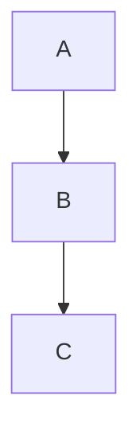

<!-- ✅ Correcto -->
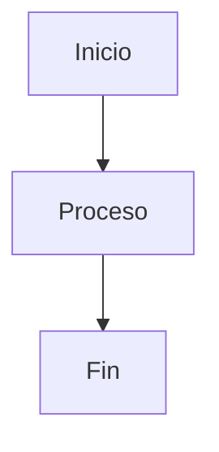
```

### 4. Enlaces Rotos
```markdown
<!-- ❌ Evitar -->
[enlace roto](url-que-no-existe.com)

<!-- ✅ Verificar siempre -->
[enlace funcionando](https://ejemplo.com)
```

## Herramientas y Recursos

### Editores de Markdown
- **[Typora](https://typora.io/)** - Editor WYSIWYG para Markdown
- **[Mark Text](https://marktext.app/)** - Editor gratuito y de código abierto
- **[Obsidian](https://obsidian.md/)** - Para tomar notas con Markdown
- **VS Code** con extensiones de Markdown

### Conversores y Procesadores
- **[Pandoc](https://pandoc.org/)** - Conversor universal de documentos
- **[markdown-it](https://markdown-it.github.io/)** - Parser de Markdown para JavaScript
- **[marked](https://marked.js.org/)** - Parser y compilador de Markdown

### Herramientas Online
- **[Dillinger](https://dillinger.io/)** - Editor online con vista previa
- **[StackEdit](https://stackedit.io/)** - Editor completo en el navegador
- **[Markdown Live Preview](https://markdownlivepreview.com/)** - Vista previa rápida
- **[Mermaid Live Editor](https://mermaid.live/)** - Para crear diagramas

### Herramientas para Diagramas
- **[Mermaid Live Editor](https://mermaid.live/)** - Editor online para diagramas Mermaid
- **[Draw.io](https://app.diagrams.net/)** - Crear diagramas que luego puedes exportar
- **[Excalidraw](https://excalidraw.com/)** - Diagramas de aspecto dibujado a mano
- **[PlantUML](https://plantuml.com/)** - Alternativa a Mermaid para diagramas

### Referencias y Documentación
- **[CommonMark Spec](https://commonmark.org/)** - Especificación estándar
- **[GitHub Flavored Markdown](https://github.github.com/gfm/)** - Extensiones de GitHub
- **[Markdown Guide](https://www.markdownguide.org/)** - Guía completa
- **[Mermaid Documentation](https://mermaid-js.github.io/mermaid/)** - Para diagramas

## Casos de Uso Comunes

### Documentación Técnica
```markdown
# API Documentation

## Endpoint: `/api/users`

### GET /api/users

Retrieves a list of users.

**Parameters:**
- `limit` (integer, optional): Maximum number of users to return
- `offset` (integer, optional): Number of users to skip

**Response:**
```json
{
  "users": [...],
  "total": 100,
  "limit": 10,
  "offset": 0
}
```

**Status Codes:**
- `200`: Success
- `400`: Bad Request
- `500`: Internal Server Error

**Flow Diagram:**
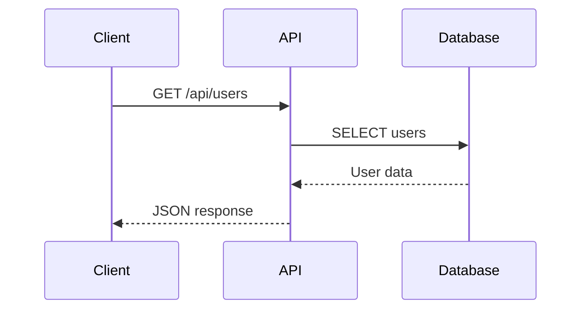
```

### README de Proyecto
```markdown
# Mi Proyecto Increíble


## Descripción

Una breve descripción de lo que hace tu proyecto.

## Arquitectura

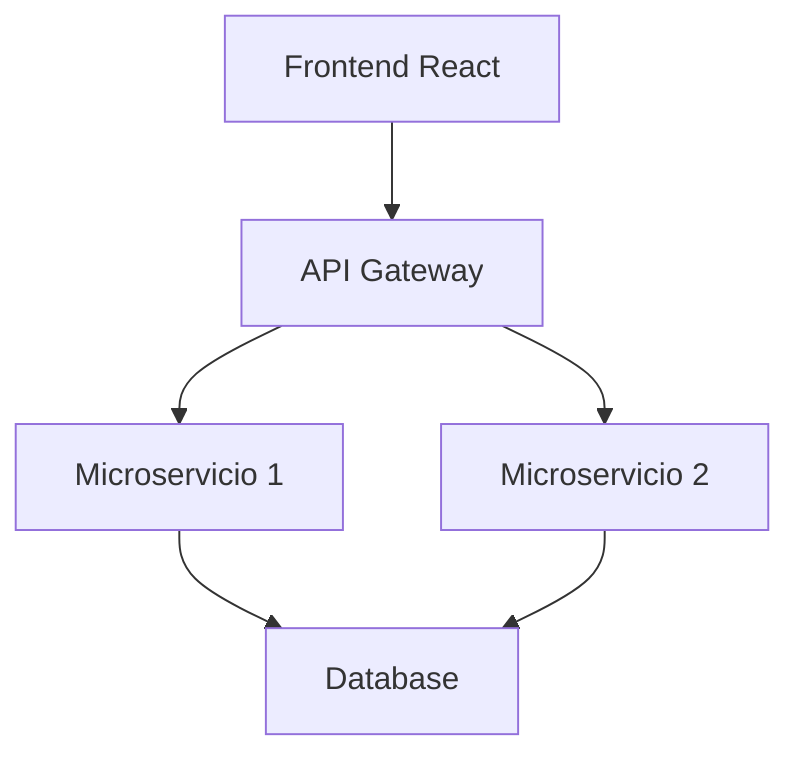

## Instalación

```bash
npm install mi-proyecto
```

## Uso

```javascript
import { MiClase } from 'mi-proyecto';

const instancia = new MiClase();
instancia.metodo();
```

## Contribuir

1. Fork el proyecto
2. Crea una rama para tu feature
3. Commit tus cambios
4. Push a la rama
5. Abre un Pull Request
```

## Conclusión

Markdown es una herramienta versátil y poderosa que va mucho más allá del formato básico de texto. Con diagramas profesionales, fórmulas matemáticas, tablas avanzadas y elementos HTML, puedes crear documentación rica y profesional que realmente destaque.

### Los diagramas que has visto en esta guía demuestran que Markdown puede:

- **Documentar arquitecturas complejas** de manera visual y clara
- **Mostrar flujos de datos** y procesos de manera profesional
- **Explicar secuencias temporales** con precisión
- **Mantener documentación actualizada** fácilmente

### La clave del éxito con Markdown está en:

- **Practicar regularmente** para familiarizarte con la sintaxis
- **Usar las herramientas adecuadas** para tu flujo de trabajo
- **Mantener la consistencia** en tu formato
- **Aprovechar los diagramas** para comunicar ideas complejas
- **Documentar el contexto** de tus diagramas y código

Ya sea que estés escribiendo documentación técnica, creando contenido para blogs, documentando APIs, o explicando arquitecturas de software, Markdown con Mermaid te proporciona todas las herramientas necesarias para crear contenido profesional, mantenible y visualmente atractivo.

¡Empieza a experimentar con estos elementos y verás cómo Markdown puede transformar completamente tu forma de escribir, documentar y comunicar ideas técnicas!